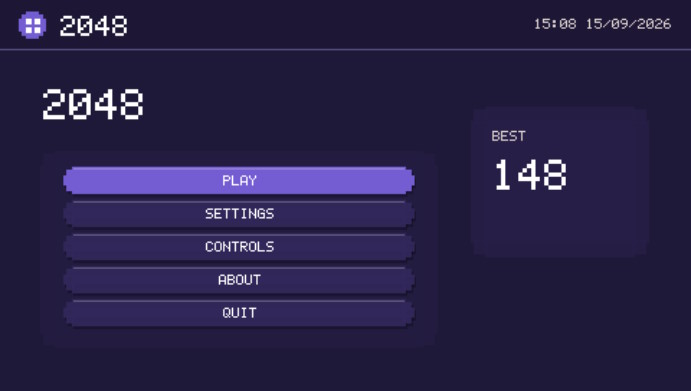
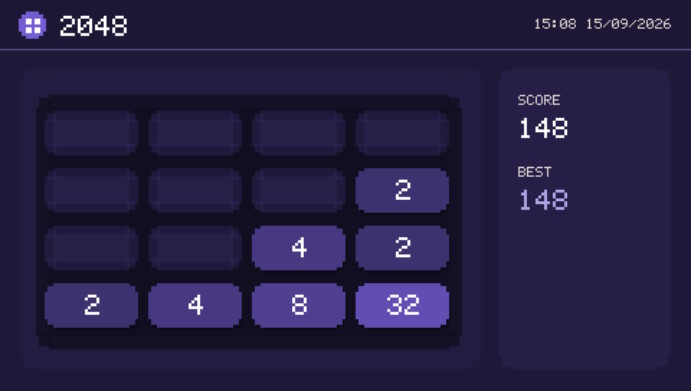
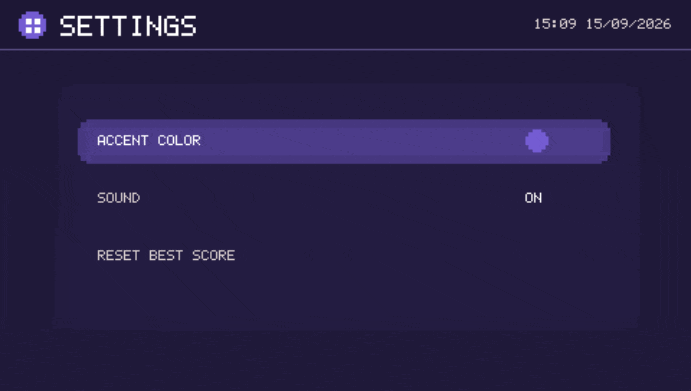

# 2048 for PSP

A native 2048 game for the Sony PSP written in C

[](https://github.com/violinmelody/2048PSP/actions/workflows/build.yml)

**Version:** 1.0.0  
**Author:** Miss Violin Melody  
**Website:** https://violinmelody.net







This project is not affiliated with or endorsed by Sony. [PSPDEV/PSPSDK](https://github.com/pspdev/pspsdk) is the open-source SDK/toolchain used to build the game.

## Features

- Native 480x272 PSP renderer using `sceGu`
- D-pad and analog tile movement
- Animated tile movement
- In-game sound effects
- Persistent high score and settings on the Memory Stick
- Themes

## Clone the repository

Install Git then clone the repository and enter its directory:

```sh
git clone https://github.com/violinmelody/2048PSP.git
cd 2048PSP
```

## Requirements

You need a working PSPDEV/PSPSDK toolchain and GNU Make. The following commands should be available:

```sh
psp-config
psp-gcc
mksfoex
pack-pbp
make
```

[PSPDEV installation documentation](https://pspdev.github.io/installation.html) is available on the PSPDEV website. If you use a prebuilt PSPDEV archive on Linux, extract it to a permanent location and configure the environment, for example:

```sh
export PSPDEV="$HOME/pspdev"
export PATH="$PSPDEV/bin:$PATH"
```

Verify the toolchain:

```sh
psp-config --pspsdk-path
psp-gcc --version
```

For convenience put the exports in your shell profile if you work on the project regularly.

## Build

From the repository root:

```sh
make clean
make -j"$(nproc)"
```

The build creates `EBOOT.PBP` in the repository root. The Makefile embeds the title `2048` and `APP_VER=1.00` in `PARAM.SFO`, the PSP module itself is version 1.0.

To rebuild after editing source files, normally only this is needed:

```sh
make -j"$(nproc)"
```

To force a completely clean build:

```sh
make clean
make -j"$(nproc)"
```

## Install on a PSP

Create:

```text
ms0:/PSP/GAME/2048/
```

Copy the compiled file to:

```text
ms0:/PSP/GAME/2048/EBOOT.PBP
```

The PSP must be configured to run homebrew software.

## Save data

Version 1.0.0 uses two independent files:

```text
ms0:/PSP/GAME/2048/score.dat
ms0:/PSP/GAME/2048/settings.dat
```

`score.dat` stores the persistent best score. `settings.dat` stores the selected accent color and sound preference. If the normal Memory Stick path cannot be opened, the same filenames are used relative to the game working directory as a fallback.

## License

MIT. See [LICENSE](./LICENSE).
